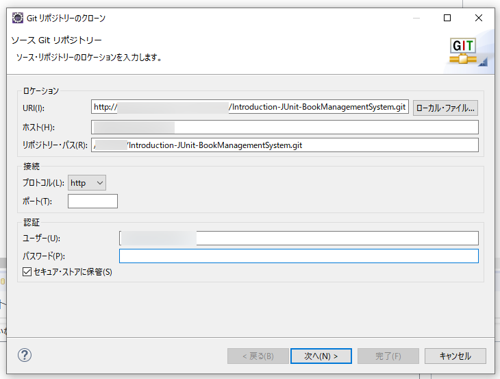
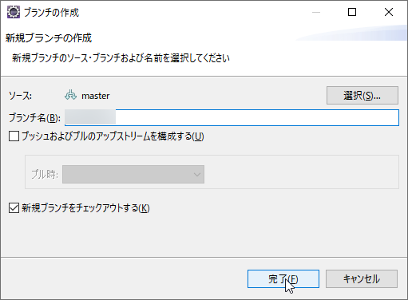

## 起動手順
1. リポジトリからクローンする（詳細は略）  
  
1. 読み込んだリポジトリを右クリックし、プロジェクトのインポートをクリックし、プロジェクトを読み込む（詳細は略）  
  
1. プロジェクトを右クリックし、`実行`→`SpringBootアプリケーション`をクリックすることで、アプリケーションを起動することができる  
  
1. 停止するには、上部の停止ボタンを押す  
  

## ブランチを作成手順
1. プロジェクトを右クリックし、`チーム`→`切り替え`→`新規ブランチ`をクリックする
  
1. 名前の分かるブランチ名を付け`完了`を押す  
  
