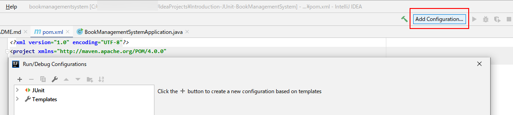
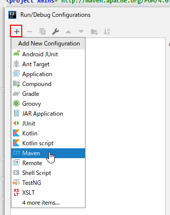
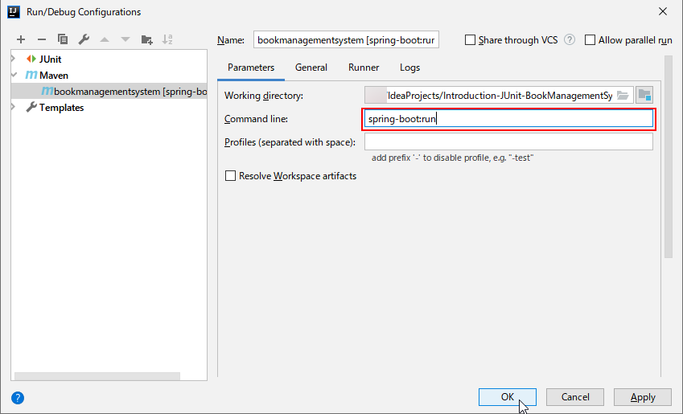
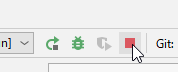
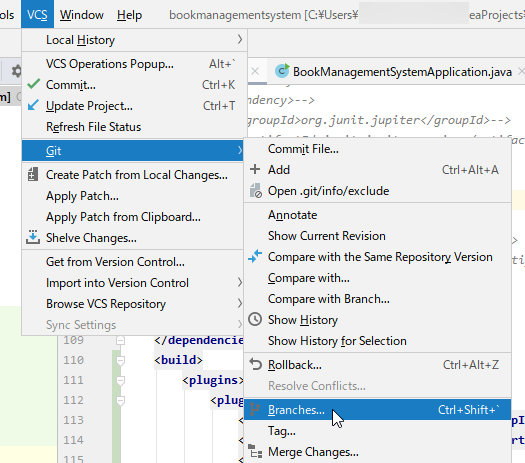
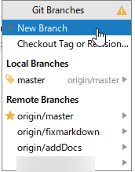
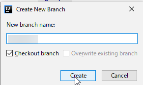

## 起動手順
1. 右上の`AddConfiguration`をクリックし、実行設定画面を開く  
  
1. 左上の`＋`をクリックし、`Maven`をクリックする  
  
1. CommandLineに`spring-boot:run`をを入力し、OKを押す  
  
1. 左上のRunボタンを押し、実行する  
  
1. 停止する場合は、Stopボタンを押す  
  

## ブランチ作成手順
1. メニュー`VCS`から`Git`→`Branches`をクリックする  
  
1. `New Branch`をクリックする  
  
1. 名前がわかるブランチ名を入力し、`Create`をクリックする  
  