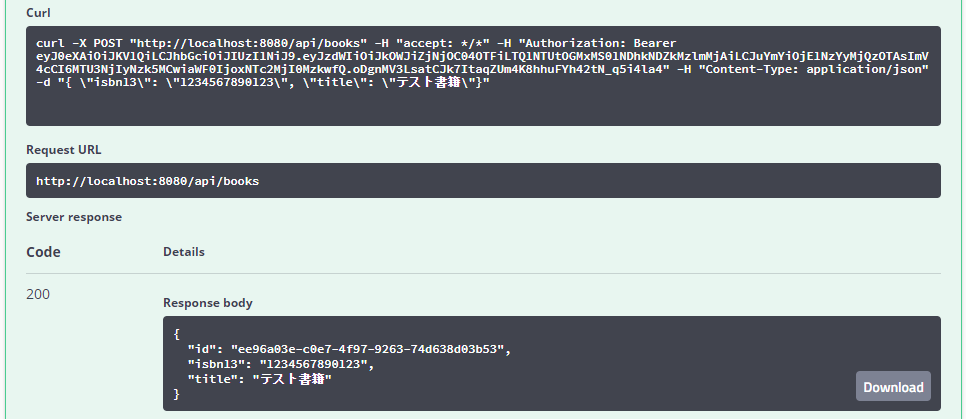

## 操作手順
1. `http://localhost:8080/swagger-ui.html`を開く  
  
1. ログイン操作をを開き、Userに`admin`、Passwordに`password`を入力し、Executeを押す  
adminは管理者権限を持った初期ユーザーです。同様に一般利用者権限の初期ユーザとしてUserに`user`、Passwordに`password`が設定されています。  
  
1. Response Headerを確認し、authorizationヘッダーの内容をコピーする  
  
1. ページ上部の`Authorize`ボタンをクリックする  
  
1. Valueに先程コピーしたトークンをペーストし、`Authorize`ボタンをクリックする  
  
1. JSON形式で登録する書籍情報を入力し、`Execute`を押すことでRESTAPIを呼び出すことができる  
  
1. 実行結果は下のResponsesから確認できる  
  
1. 発行されたBookIdを使用して、下記の画像のように実行することで、保存した書籍情報を確認できる  
  
  